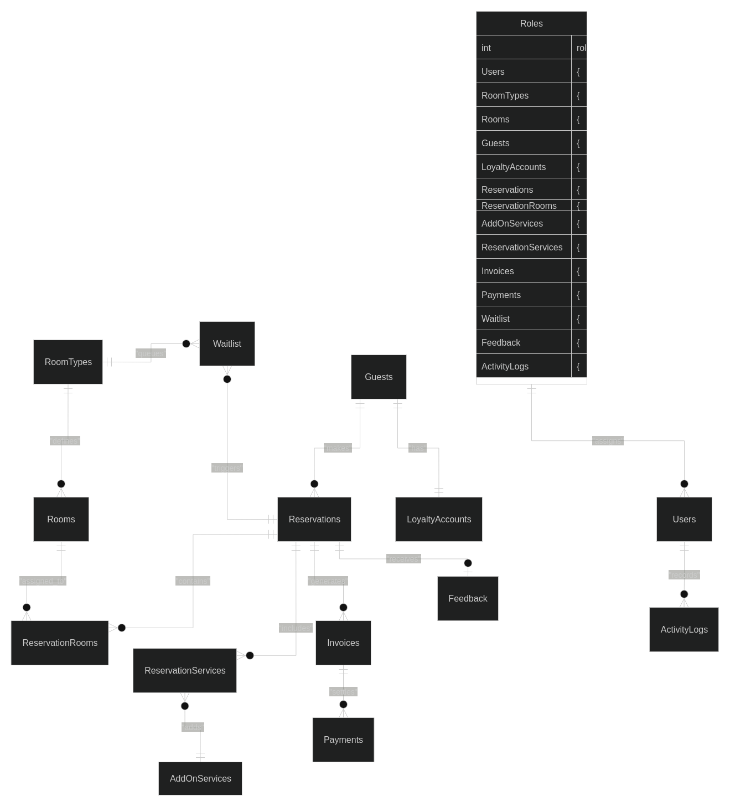

# ERD Table Overview / Purpose

| Category | Table Name | Key Purpose |
|----------|------------|-------------|
| Authentication | Roles | Defines access levels (Admin/Manager). |
| Authentication | Users | Stores hashed credentials and links to Roles. |
| Inventory | RoomTypes | Defines room attributes (capacity, rates, type). |
| Inventory | Rooms | Tracks individual room inventory and availability status. |
| Customer Data | Guests | Stores primary guest contact information. |
| Customer Data | LoyaltyAccounts | Tracks point balances and history for each guest. |
| Reservations | Reservations | Main record for bookings (dates, status, guest link). |
| Reservations | ReservationRooms | Junction table for group bookings (link between Reservation and Room). |
| Financials | Invoices | Stores subtotal, tax, and calculated totals. |
| Financials | Payments | Records payment history (cash, card, points) and refunds. |
| Operational | AddOnServices | Catalog of available extra services (Spa, Wi-Fi, etc.). |
| Operational | ReservationServices | Junction table linking specific services to a reservation. |
| Operational | Waitlist | Pending requests for unavailable room types. |
| Operational | Feedback | Stores ratings and comments submitted by guests. |
| Operational | ActivityLogs | Audit trail of all administrative actions. |

# Diagram of Domain Model 
